   

     
   

### 👋 Hi there, I'm Mohammed Jonaed Haque!

IT student (Artificial Intelligence) at Macquarie University, Sydney — building with code, exploring AI, and always up for the next project.

---

### 🛠️ When I build, I reach for

---

### 🚀 What I've been building

- 🎮 **Space Salvage Run** — a 2D top-down game prototype built in Unity, with player movement, hazards, scoring and full game-over logic.
- 🌐 **Network Topology Simulation** — a routed multi-device network built in Cisco Packet Tracer, using routers, switches and VLANs.
- 🎨 **Website Design Concept** — a full site design in Figma, covering layout, navigation and visual system.
- 🛒 **Amazon Affiliate Marketing Project** — an independent affiliate campaign, researching products and producing content, with real lessons in what does (and doesn't) convert.

---

### 📊 My GitHub stats

  
  

  

---

### 🤝 Let's connect

📍 Sydney, Australia — open to internship and graduate opportunities
